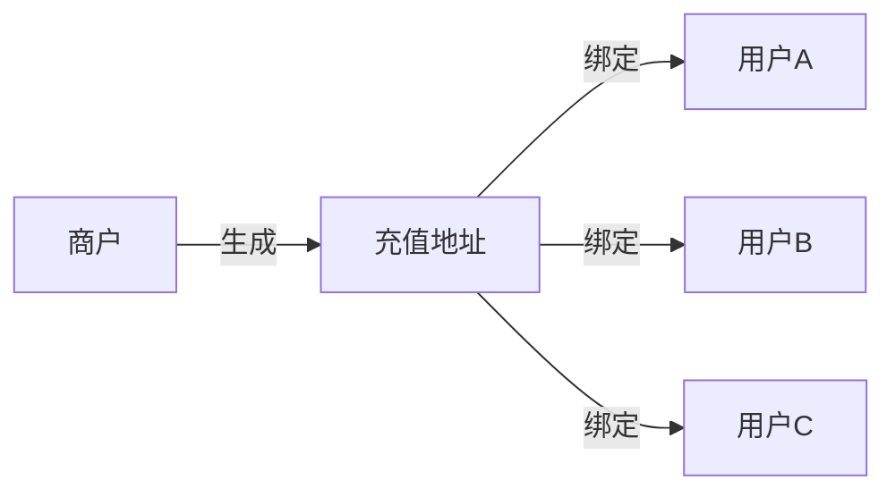
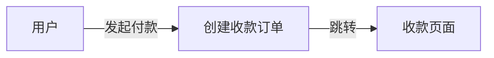
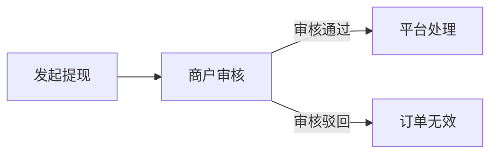

## 充值
支持种类丰富的虚拟货币充值，业务方为用户生成一个专属的区块链地址，当平台监听到地址有入账时，通过回调及时通知您。

_**商户流程：**_

_**平台流程：**_

## 订单收款
除了用上面方式进行收款，您还可以直接调用`发起收款`接口，通过跳转平台提供的页面发起收款，而不需要预先为用户生成专属地址。体验和传统支付渠道一样。

_**商户流程：**_

_**平台流程：**_

## 提现
通过客户端或`发起提币`接口，你可快速应对用户的提现需求，你也可以添加提现审核策略，加强安全防御。

_**商户流程：**_

_**平台流程：**_

