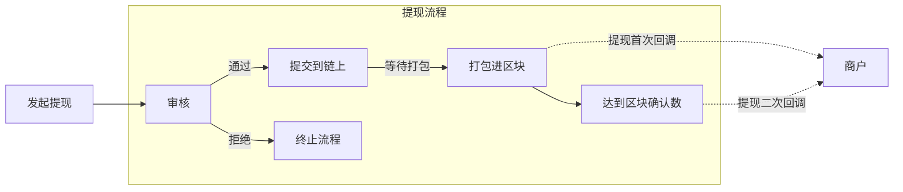
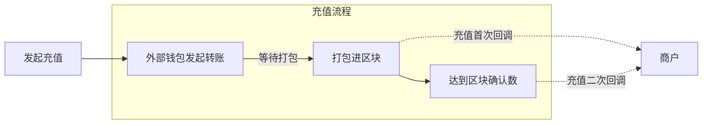

## 介绍
### 提现回调
>当商户发起一笔提现时，如需审核，该笔订单首先会进入应用程序的审核流程，审核通过后，
平台进行安全检查后发起链上交易，当交易成功被打包时，会回调通知商户，此时订单状态为`WaitingConfirmation`,
当交易达到区块确认数后，将再次回调通知商户，此时订单状态为`Success`，订单完成。

<Tip>

对于提现，除了平台进行回调通知，也可以使用`提币查询`接口主动跟踪订单处理情况。

</Tip>
### 充值回调
>当有资产向商户生成的区块链地址进行充值时，平台的监听程序将第一时间回调通知商户，此时订单状态为`WaitingConfirmation`,
当交易达到区块确认数后，将再次回调通知商户，此时订单状态为`Success`或`Fail`，订单完成。

## FAQs
### 1、什么是区块确认数？
是指一个交易被区块链网络验证并写入区块后，后续在其之后生成的区块数量。每一个新的区块都进一步确认之前的所有交易，因此确认数越多，交易被篡改的可能性越小。

例如在比特币网络中，通常建议至少等待 6 次确认来确保交易的不可逆性。不同的区块链网络对安全性要求不同，所需的确认数也会有所不同。

### 2、为什么一笔交易回调两次？
当一笔转账交易刚被打包到区块中时，平台会立即进行第一次回调通知，以便商户能快速响应，做出相应的业务处理，例如对于钱包商来说，可以快速为用户上账，但是此时为冻结状态。

由于交易只有一个确认，由于区块链网络的特性，此时仍然有很小的概率因为网络分叉、重组等原因导致交易回滚或无效。所以交易需要经过一定的区块确认数后，平台会进行第二次回调通知，
此时交易已经基本不可能被回滚或改变，此时可以解冻转账金额，安全上账。

**两次回调的机制，即能快速将交易信息通知到商户，提升用户体验，同时又能保障交易的安全性。**

### 3、回调时应该如何处理？
不同的业务，可能对应做出的业务处理会有所不同，更重要的是你需要充分了解区块链的交易特性以及回调机制，
以交易所举例：

当充值第一次回调时，此时订单状态为`WaitingConfirmation`,此时可上账对应的金额，但此时为冻结状态，用户不可向外部提现。

当充值第二次回调时，此时订单状态为`Success`或`Fail`,如果为`Success`，解冻对应的金额,成功上账，如果为`Fail`，则解冻+取消入账。

### 4、如何保证回调的安全性？
你可以在商户后台申请生成回调的API Key/Secret，平台在回调时，会使用你的API Key/Secret进行签名，在收到回调后进行验证即可。

### 5、回调失败如何处理？
你可进入商户后台，在异常回调页面中进行手动推送。

### 6、如何自定义区块确认数？
你可以在商户后台自定义回调所需的区块确认数。商户可以控制在交易达到多少个区块确认后进行第一次回调通知，达到多少区块后再发送第二次回调通知。

<Note>
除非你对区块确认数有特殊需求，以及你已充分了解不同链上的区块确认规则，否则建议保持平台默认的区块确认数即可
</Note>
